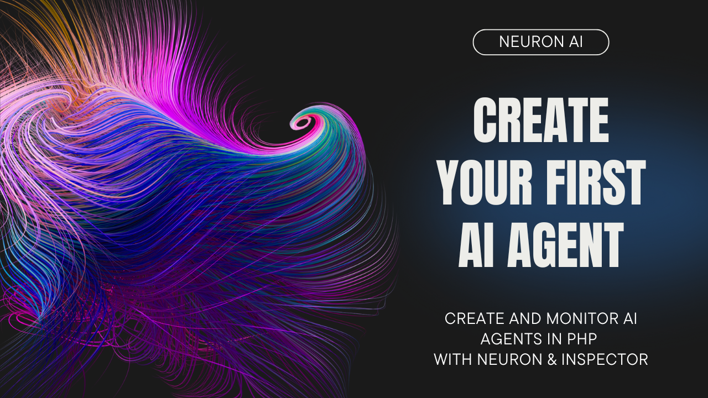

# Recursive Abstractive Processing for Tree-Organized Retrieval

This module implements the RAPTOR retreival strategy for the Neuron PHP AI framework.

## The Problem with Traditional Retrieval

Most retrieval-augmented models work by breaking down documents into small chunks and retrieving only the most relevant ones. However, this approach has some limitations:

- **Loss of Context**: Retrieving only small, isolated chunks may miss the bigger picture especially for documents with long contexts.
- **Difficulty in Multi-Step Reasoning**: Some questions require information from multiple sections of a document.

**Use RAPTOR when:**
- Users ask open-ended questions that require comprehensive coverage
- Your domain involves complex topics where context matters as much as facts
- You need to handle queries about themes, trends, or relationships across documents

**Stick with traditional RAG when:**
- Users primarily need quick, specific fact retrieval
- Processing speed and token efficiency are critical constraints

You can read the full paper here: https://arxiv.org/html/2401.18059v1

## What is Neuron?

Neuron is a PHP framework for creating and orchestrating AI Agents. It allows you to integrate AI entities in your existing
PHP applications with a powerful and flexible architecture. We provide tools for the entire agentic application development lifecycle,
from LLM interfaces, to data loading, to multi-agent orchestration, to monitoring and debugging.
In addition, we provide tutorials and other educational content to help you get started using AI Agents in your projects.

**[Go to the official documentation](https://neuron.inspector.dev/)**

[**Video Tutorial**](https://www.youtube.com/watch?v=oSA1bP_j41w)

[](https://www.youtube.com/watch?v=oSA1bP_j41w)

---

## Requirements

- PHP: ^8.1
- Neuron: ^2.0

## Install RAPTOR retrieval

Install the latest version of the package:

```
composer require neuron-core/neuron-raptor-retreival
```

## How to use RAPTOR in your agent

Or use the RAPTOR component directly into the agent. RAPTOR needs a vector store, an embedding provider and uses an LLM
to perform the summarization:

```php
use NeuronAI\RAG\Retrieval\RetrievalInterface;
use NeuronAI\Raptor\RaptorRetrieval;

class WorkoutTipsAgent extends RAG
{
    protected function retrieval(): RetrievalInterface
    {
        return new RaptorRetrieval(
            $this->resolveVectorStore(),
            $this->resolveEmbeddingsProvider(),
            $this->resolveProvider(), // Used for summarization
        );
    }

    protected function embeddings(): EmbeddingsProviderInterface
    {
        return new ...
    }

    protected function vectorStore(): VectorStoreInterface
    {
        return new ...
    }
}
```

## Clustering strategy

RAPTOR algorithm uses a clustering strategy to group the retrieved documents into clusters. Choose based on your content characteristics:

### Similarity Clustering (default)

Groups documents with clear thematic boundaries. Best for already well-organized content with distinct topics.

**Use Similarity Clustering when:**

- You have heterogeneous content with clear topic boundaries
- Your documents have distinct themes that don't overlap much
- Performance is important (faster processing)

```php
use NeuronAI\RAG\Retrieval\RetrievalInterface;
use NeuronAI\Raptor\RaptorRetrieval;
use NeuronAI\Raptor\Clustering\SimilarityClusteringStrategy;

class WorkoutTipsAgent extends RAG
{
    protected function retrieval(): RetrievalInterface
    {
        return new RaptorRetrieval(
            $this->resolveVectorStore(),
            $this->resolveEmbeddingsProvider(),
            $this->resolveProvider(), // Used for summarization
            new SimilarityClusteringStrategy()
        );
    }

    protected function embeddings(): EmbeddingsProviderInterface
    {
        return new ...
    }

    protected function vectorStore(): VectorStoreInterface
    {
        return new ...
    }
}
```

### Gaussian Mixture Clustering

Handles overlapping topics where documents may belong to multiple themes simultaneously.
Useful for research papers, news articles, or any content where topics naturally blend together rather than having sharp boundaries.

**Use GMM when:**

- Documents may relate to multiple topics simultaneously
- You want the algorithm to discover the "natural" number of clusters in your data
- You're dealing with research papers, news, or complex content where topics blend

```php
use NeuronAI\RAG\Retrieval\RetrievalInterface;
use NeuronAI\Raptor\RaptorRetrieval;
use NeuronAI\Raptor\Clustering\GaussianMixtureClustering;

class WorkoutTipsAgent extends RAG
{
    protected function retrieval(): RetrievalInterface
    {
        return new RaptorRetrieval(
            $this->resolveVectorStore(),
            $this->resolveEmbeddingsProvider(),
            $this->resolveProvider(), // Used for summarization
            new GaussianMixtureClustering()
        );
    }

    protected function embeddings(): EmbeddingsProviderInterface
    {
        return new ...
    }

    protected function vectorStore(): VectorStoreInterface
    {
        return new ...
    }
}
```
